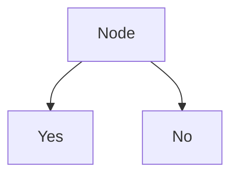
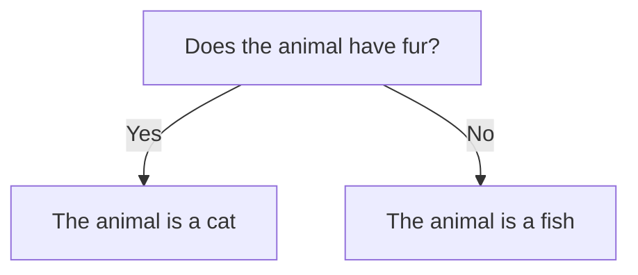

# Basic Algorithm Structures

## What Are Algorithms?

Algorithms = step-by-step instructions for solving problems or performing 
tasks. They're the foundation of how computers solve problems: processing 
data, making decisions, controlling program flow.

### Maze Example (Really Good Analogy!)

The instructor used a maze example to explain algorithms:

- **Start position**: `Set position to start`
- **Decision making**: `If there is a path to the right, take it. Or, if there
  is a wall ahead, turn left`
- **Tracking progress**: `Mark position as visited` (avoid loops!)
- **Backtracking**: `If no unvisited paths available, return to previous 
  position`
- **Goal reached**: `If exit is found, stop and return success`

**Complete pseudocode from the example:**
```
Set position to start
Mark position as visited
While position is not exit:
  If there is a path to the right and it is unvisited:
    Move right
  Else if there is a path forward and it is unvisited:
    Move forward  
  Else if there's a path to the left and it is unvisited:
    Move left
  Else if there is a path backward and it is unvisited:
    Move backward
  Else:
    Backtrack to the previous position
  Mark new position as visited
If exit is found:
  Return success
Else:
  Return failure
```

## Conditional Statements

These allow programs to make decisions based on whether conditions are 
true/false. They control flow and manage complexity by determining which 
code parts to execute, skip, or repeat.

### If/Then Statements

**Light switch analogy** - perfect way to think about it:
- Check condition: Is light switch on or off?
- Take action based on condition: `If light switch is 'off', then turn
  light switch on`
- Or, `If light switch is 'on', then turn light switch off`

Without conditionals, algorithms can't perform comparisons or make decisions.

### Switch Statements

More versatile for handling multiple conditions.

**Weekly planner analogy**:

A switch statement is like a weekly planner that tells you what to do
each day of the week.

| Week Day  | Task                            |
|-----------|---------------------------------|
| Monday    | Start home project              |
| Tuesday   | Bowling league                  |
| Wednesday | Mow the lawn                    |
| Thursday  | Get project materials           |
| Friday    | Hang out with friends           |
| Saturday  | Play video games                |
| Sunday    | Relax and prepare for next week |

- Each day = different case
- Look at what day it is, decide what task to do
- Can have default action if no specific case matches (error handling)

**Pseudocode example:**
```
If day of week is "Monday", then "Start home project"
If day of week is "Tuesday", then "Go bowling"  
If day of week is not "Monday" or "Tuesday", "do laundry"
```

Switch statements handle multiple conditions efficiently.

## Categorical Statements

Method for analyzing and classifying statements using logical rules. 
Determines if statements are true or how they relate to each other.

Uses affirmative/negative statements to determine truth or relationships.
Good for organizing and managing data based on criteria.

### Four Types:

**Subject = S, Predicate = P**

1. **Universal Affirmative**: "All S are P"
   - Example: "All dogs are mammals"

2. **Universal Negative**: "No S are P"  
   - Example: "No cats are reptiles"

3. **Particular Affirmative**: "Some S are P"
   - Example: "Some birds can fly"

4. **Particular Negative**: "Some S are not P"
   - Example: "Some fish are not carnivores"

These logical structures help analyze and categorize statements and understand 
their relationships.

## Binary Structures

Based on binary system concept - decisions made on two possible outcomes 
(true/false, yes/no). Fundamental for making quick, efficient choices.

Uses binary decision diagrams where each decision node leads to one of two 
paths.



**Animal classification example:**
```
Root question: "Does the animal have fur?"
If "yes" → "The animal is a cat"
If "no" → [presumably "The animal is a fish"]
```

A flowchart representing this pseudocode would look like this:


## Key Takeaways

Mastering these basic algorithm structures gives me tools to:
- Solve problems efficiently  
- Write more effective code
- Handle increasingly complex programming challenges

The foundational skills covered:
- Conditional statements (if/then, switch)
- Categorical statements (classification logic)
- Binary structures (two-outcome decisions)

